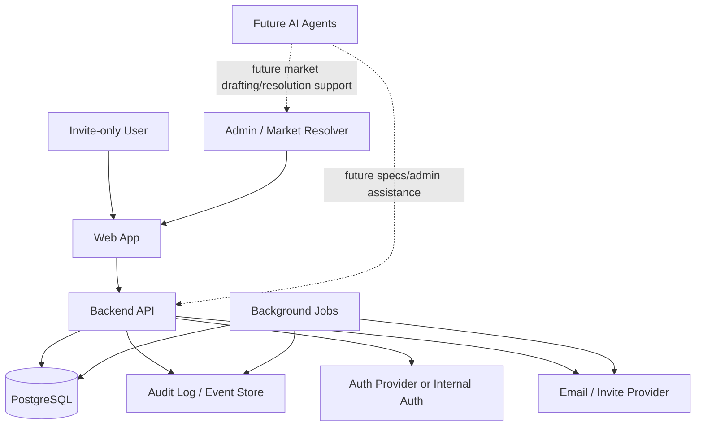
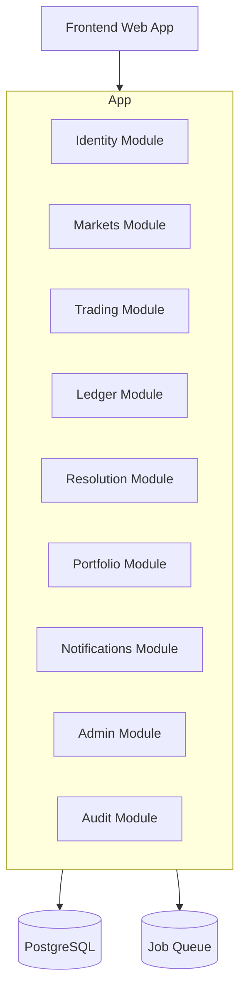
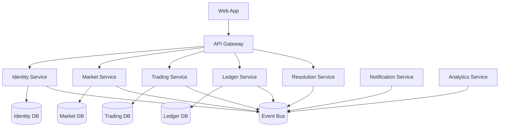
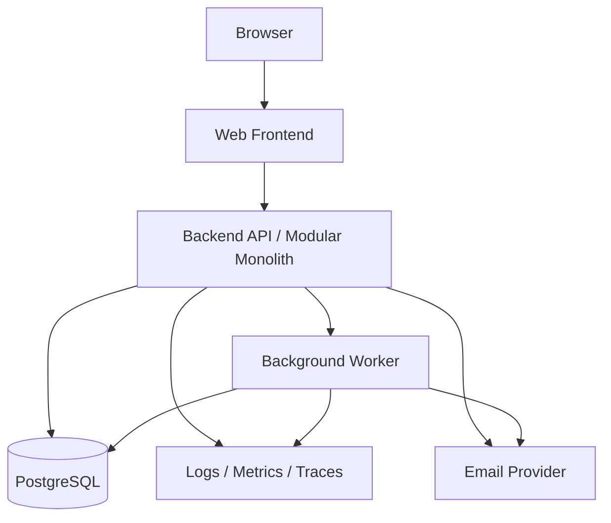

# Phased Architecture for a Private Prediction Market Platform

## Assumptions

The platform is:

* Web app.
* Invite-only.
* Binary markets initially: `YES` / `NO`.
* Play-money or private-points ledger.
* No real-money deposits or withdrawals in v1.
* Manual/admin market resolution.
* Designed for future AI-assisted implementation.
* Priorities: simplicity, correctness, auditability, extensibility.

For v1, I would strongly recommend a **modular monolith** with a single relational database, strong internal boundaries, and an append-only ledger/event trail.

---

# 1. Context Diagram



At v1, the platform can be a single backend application exposing APIs to a web frontend. Internally, it should already be divided into clean modules so that later extraction into services is possible.

---

# 2. Major Bounded Contexts / Modules

## 2.1 Identity & Access

Responsible for:

* User accounts.
* Invite-only onboarding.
* Authentication.
* Group membership.
* Role management.
* Admin permissions.

Core concepts:

```text
User
Invite
Group
Membership
Role
Session
```

Roles may include:

```text
OWNER
ADMIN
MARKET_CREATOR
RESOLVER
USER
READ_ONLY
```

For v1, keep role logic simple but explicit.

---

## 2.2 Market Management

Responsible for defining markets.

Core concepts:

```text
Market
Outcome
MarketCategory
MarketStatus
MarketRule
MarketMetadata
```

For binary markets:

```text
Market:
  question: "Will Team A win?"
  outcomes: YES, NO
  close_at: datetime
  resolve_by: datetime
  status: DRAFT | OPEN | CLOSED | RESOLVED | CANCELLED | DISPUTED
```

This module owns:

* Market creation.
* Editing before opening.
* Opening and closing.
* Freezing markets.
* Market metadata.
* Resolution criteria.
* Market lifecycle transitions.

---

## 2.3 Trading / Betting

Responsible for accepting user positions.

Since v1 uses play-money points, I would model user actions as **orders/bets** and resulting **positions**, even if the mechanism is simple.

Core concepts:

```text
Order
Trade
Position
Quote
MarketPrice
```

Depending on your v1 mechanism, this module may implement:

* Fixed-price binary bets.
* Simple 0–100 share purchases.
* LMSR later.
* Limit-order book later.

Recommended v1: **simple binary shares priced from 0 to 100**, possibly with admin-seeded prices or a simple automated pricing curve.

---

## 2.4 Ledger

This is one of the most important modules.

Responsible for all point movements.

Core concepts:

```text
Account
LedgerEntry
LedgerTransaction
BalanceSnapshot
```

Do **not** update balances casually. Use an append-only ledger.

Example transaction types:

```text
INITIAL_GRANT
BET_PLACED
BET_CANCELLED
MARKET_RESOLVED_WIN
MARKET_RESOLVED_LOSS
MARKET_VOID_REFUND
ADMIN_ADJUSTMENT
PROMOTIONAL_CREDIT
```

Every balance change should be traceable.

---

## 2.5 Portfolio

Responsible for user-facing aggregation.

Core concepts:

```text
UserBalance
OpenPositions
ResolvedPositions
PnL
Exposure
MarketPortfolioView
```

This module mostly reads from:

* Ledger.
* Trades/orders.
* Positions.
* Market status.

In v1, this can be implemented as SQL views or query-layer projections.

---

## 2.6 Resolution & Disputes

Responsible for closing markets and determining outcomes.

Core concepts:

```text
Resolution
ResolutionEvidence
Dispute
DisputeComment
ResolutionAudit
```

For v1:

* Admin manually resolves.
* Admin selects winning outcome.
* Admin provides explanation/evidence.
* System settles all positions.
* Users may optionally dispute within a window.

Resolution must be idempotent: running settlement twice must not double-credit users.

---

## 2.7 Notifications

Responsible for user communications.

Examples:

* Invite email.
* Market opened.
* Market closing soon.
* Market resolved.
* Dispute opened.
* Points credited.

For v1:

* Email only.
* In-app notification table optional.
* Background jobs for async delivery.

---

## 2.8 Admin & Moderation

Responsible for:

* Creating markets.
* Managing users.
* Managing groups.
* Resolving markets.
* Adjusting balances.
* Reviewing disputes.
* Freezing suspicious activity.

Admin actions should be heavily audited.

---

## 2.9 Audit & Compliance-lite

Even for a play-money private app, you want strong auditability.

Responsible for:

* Append-only audit events.
* Admin action history.
* Ledger transaction traceability.
* Market lifecycle history.
* User activity history.

Core concepts:

```text
AuditEvent
Actor
Action
EntityType
EntityId
BeforeState
AfterState
Metadata
```

---

# 3. Service Decomposition Options

## Option A: Modular Monolith

Recommended for v1.



### Pros

* Fastest to build.
* Easier consistency.
* Easier local development.
* Easier transactional correctness.
* Lower operational burden.
* Better for small invite-only product.

### Cons

* Requires discipline to keep module boundaries clean.
* Can become tangled if not structured well.
* Scaling individual domains separately is harder later.

### Best for

The first serious version.

---

## Option B: Microservices Later

Possible future decomposition:



### Pros

* Better long-term scalability.
* Stronger isolation.
* Independent deployments.
* Easier specialized ownership.

### Cons

* Much higher complexity.
* Distributed transactions.
* More failure modes.
* Harder local development.
* Overkill for friends-and-family MVP.

### Best for

Later stages, after the domain model stabilizes.

---

# 4. Recommended v1 Architecture

## High-Level Recommendation

Use:

* **Next.js / React frontend** or equivalent.
* **Single backend application**.
* **PostgreSQL**.
* **Modular monolith architecture**.
* **Append-only ledger**.
* **Explicit audit log**.
* **Background job queue**.
* **Admin-first resolution workflow**.
* **Role-based access control**.
* **Simple binary-share market mechanism**.

Example stack:

```text
Frontend:
  Next.js / React / TypeScript

Backend:
  TypeScript Node.js, Python FastAPI, Go, or Elixir/Phoenix

Database:
  PostgreSQL

Queue:
  Postgres-backed jobs initially, or Redis/BullMQ, or Sidekiq-style equivalent

Auth:
  Managed auth provider or simple email/password + magic links

Deployment:
  Single containerized app + managed PostgreSQL
```

## Recommended Runtime Shape



## Why This Is the Right v1

Because prediction markets need strong correctness around:

* Balances.
* Settlement.
* Position accounting.
* Market status transitions.
* Auditability.
* Admin actions.

A modular monolith with PostgreSQL transactions gives you correctness much earlier than a distributed system.

---

# 5. Database Schema Overview

Below is a practical relational schema outline.

## 5.1 Users and Access

```sql
users (
  id UUID PRIMARY KEY,
  email TEXT UNIQUE NOT NULL,
  display_name TEXT NOT NULL,
  status TEXT NOT NULL, -- INVITED, ACTIVE, SUSPENDED, DELETED
  created_at TIMESTAMPTZ NOT NULL,
  updated_at TIMESTAMPTZ NOT NULL
);

groups (
  id UUID PRIMARY KEY,
  name TEXT NOT NULL,
  slug TEXT UNIQUE NOT NULL,
  created_by UUID REFERENCES users(id),
  created_at TIMESTAMPTZ NOT NULL
);

memberships (
  id UUID PRIMARY KEY,
  group_id UUID REFERENCES groups(id),
  user_id UUID REFERENCES users(id),
  role TEXT NOT NULL, -- OWNER, ADMIN, USER
  status TEXT NOT NULL, -- ACTIVE, REMOVED
  created_at TIMESTAMPTZ NOT NULL,
  UNIQUE (group_id, user_id)
);

invites (
  id UUID PRIMARY KEY,
  group_id UUID REFERENCES groups(id),
  email TEXT NOT NULL,
  token_hash TEXT NOT NULL,
  invited_by UUID REFERENCES users(id),
  status TEXT NOT NULL, -- PENDING, ACCEPTED, EXPIRED, REVOKED
  expires_at TIMESTAMPTZ NOT NULL,
  accepted_by UUID REFERENCES users(id),
  created_at TIMESTAMPTZ NOT NULL,
  accepted_at TIMESTAMPTZ
);
```

---

## 5.2 Markets

```sql
markets (
  id UUID PRIMARY KEY,
  group_id UUID REFERENCES groups(id),
  created_by UUID REFERENCES users(id),
  title TEXT NOT NULL,
  description TEXT,
  resolution_criteria TEXT NOT NULL,
  status TEXT NOT NULL,
  -- DRAFT, OPEN, PAUSED, CLOSED, RESOLVED, CANCELLED, DISPUTED

  mechanism TEXT NOT NULL,
  -- FIXED_ODDS, SIMPLE_SHARES, LMSR, CLOB

  opens_at TIMESTAMPTZ,
  closes_at TIMESTAMPTZ NOT NULL,
  resolves_at TIMESTAMPTZ,

  resolved_outcome_id UUID,
  resolution_note TEXT,

  created_at TIMESTAMPTZ NOT NULL,
  updated_at TIMESTAMPTZ NOT NULL
);

market_outcomes (
  id UUID PRIMARY KEY,
  market_id UUID REFERENCES markets(id),
  code TEXT NOT NULL, -- YES, NO
  label TEXT NOT NULL,
  sort_order INT NOT NULL,
  UNIQUE (market_id, code)
);
```

For binary markets:

```text
YES
NO
```

But model outcomes generically so multi-outcome markets can come later.

---

## 5.3 Orders / Bets / Trades

For v1 simple shares:

```sql
orders (
  id UUID PRIMARY KEY,
  group_id UUID REFERENCES groups(id),
  market_id UUID REFERENCES markets(id),
  user_id UUID REFERENCES users(id),
  outcome_id UUID REFERENCES market_outcomes(id),

  side TEXT NOT NULL, -- BUY, SELL
  order_type TEXT NOT NULL, -- MARKET, LIMIT, ADMIN_FIXED_PRICE
  status TEXT NOT NULL, -- PENDING, FILLED, CANCELLED, REJECTED

  quantity NUMERIC(20, 6) NOT NULL,
  limit_price NUMERIC(10, 4),
  filled_quantity NUMERIC(20, 6) NOT NULL DEFAULT 0,

  idempotency_key TEXT,
  created_at TIMESTAMPTZ NOT NULL,
  updated_at TIMESTAMPTZ NOT NULL,

  UNIQUE (user_id, idempotency_key)
);

trades (
  id UUID PRIMARY KEY,
  group_id UUID REFERENCES groups(id),
  market_id UUID REFERENCES markets(id),
  outcome_id UUID REFERENCES market_outcomes(id),

  buyer_user_id UUID REFERENCES users(id),
  seller_user_id UUID REFERENCES users(id),

  price NUMERIC(10, 4) NOT NULL,
  quantity NUMERIC(20, 6) NOT NULL,

  buy_order_id UUID REFERENCES orders(id),
  sell_order_id UUID REFERENCES orders(id),

  created_at TIMESTAMPTZ NOT NULL
);
```

For a v1 without user-to-user matching, you can use a synthetic counterparty:

```text
SYSTEM_MARKET_MAKER
```

or no `seller_user_id`, depending on the mechanism.

---

## 5.4 Positions

Positions can be either materialized or computed.

For v1, I would materialize for simplicity and verify against the ledger.

```sql
positions (
  id UUID PRIMARY KEY,
  group_id UUID REFERENCES groups(id),
  market_id UUID REFERENCES markets(id),
  user_id UUID REFERENCES users(id),
  outcome_id UUID REFERENCES market_outcomes(id),

  quantity NUMERIC(20, 6) NOT NULL DEFAULT 0,
  average_price NUMERIC(10, 4) NOT NULL DEFAULT 0,
  realized_pnl NUMERIC(20, 6) NOT NULL DEFAULT 0,

  created_at TIMESTAMPTZ NOT NULL,
  updated_at TIMESTAMPTZ NOT NULL,

  UNIQUE (market_id, user_id, outcome_id)
);
```

For binary shares:

* A YES share pays `100` points if YES wins.
* A NO share pays `100` points if NO wins.
* Price is between `0` and `100`.

Example:

```text
Buy 10 YES shares at price 62.
Cost = 10 * 62 = 620 points.

If YES wins:
  payout = 10 * 100 = 1000 points
  profit = 380 points

If YES loses:
  payout = 0
  loss = 620 points
```

---

## 5.5 Ledger

Use double-entry-style accounting or at least append-only transaction entries.

```sql
accounts (
  id UUID PRIMARY KEY,
  group_id UUID REFERENCES groups(id),
  user_id UUID REFERENCES users(id),
  account_type TEXT NOT NULL,
  -- USER_POINTS, ESCROW, SYSTEM, FEES

  created_at TIMESTAMPTZ NOT NULL,

  UNIQUE (group_id, user_id, account_type)
);
```

```sql
ledger_transactions (
  id UUID PRIMARY KEY,
  group_id UUID REFERENCES groups(id),
  transaction_type TEXT NOT NULL,
  reference_type TEXT,
  reference_id UUID,
  idempotency_key TEXT,
  created_by UUID REFERENCES users(id),
  created_at TIMESTAMPTZ NOT NULL,

  UNIQUE (group_id, idempotency_key)
);
```

```sql
ledger_entries (
  id UUID PRIMARY KEY,
  transaction_id UUID REFERENCES ledger_transactions(id),
  account_id UUID REFERENCES accounts(id),

  direction TEXT NOT NULL, -- DEBIT, CREDIT
  amount NUMERIC(20, 6) NOT NULL,

  created_at TIMESTAMPTZ NOT NULL
);
```

Invariant:

```text
For every ledger_transaction:
  SUM(credits) = SUM(debits)
```

Example bet placement:

```text
User buys 10 YES at 62.

Debit user account: 620
Credit escrow account: 620
```

Example settlement if YES wins:

```text
Debit escrow/system settlement account: 1000
Credit user account: 1000
```

For play money, the accounting does not need to represent actual cash liability, but the structure should still be correct.

---

## 5.6 Market Resolution

```sql
market_resolutions (
  id UUID PRIMARY KEY,
  market_id UUID REFERENCES markets(id),
  resolved_by UUID REFERENCES users(id),
  winning_outcome_id UUID REFERENCES market_outcomes(id),
  status TEXT NOT NULL, -- PROPOSED, FINALIZED, REVERSED
  resolution_note TEXT NOT NULL,
  evidence_url TEXT,
  created_at TIMESTAMPTZ NOT NULL,
  finalized_at TIMESTAMPTZ
);
```

```sql
settlements (
  id UUID PRIMARY KEY,
  market_id UUID REFERENCES markets(id),
  resolution_id UUID REFERENCES market_resolutions(id),
  status TEXT NOT NULL, -- PENDING, RUNNING, COMPLETED, FAILED
  started_at TIMESTAMPTZ,
  completed_at TIMESTAMPTZ,
  error_message TEXT
);
```

```sql
settlement_items (
  id UUID PRIMARY KEY,
  settlement_id UUID REFERENCES settlements(id),
  user_id UUID REFERENCES users(id),
  outcome_id UUID REFERENCES market_outcomes(id),
  position_quantity NUMERIC(20, 6) NOT NULL,
  payout_amount NUMERIC(20, 6) NOT NULL,
  ledger_transaction_id UUID REFERENCES ledger_transactions(id),
  status TEXT NOT NULL, -- PENDING, SETTLED, FAILED

  UNIQUE (settlement_id, user_id, outcome_id)
);
```

---

## 5.7 Disputes

```sql
disputes (
  id UUID PRIMARY KEY,
  market_id UUID REFERENCES markets(id),
  opened_by UUID REFERENCES users(id),
  status TEXT NOT NULL, -- OPEN, ACCEPTED, REJECTED, CLOSED
  reason TEXT NOT NULL,
  created_at TIMESTAMPTZ NOT NULL,
  closed_at TIMESTAMPTZ
);

dispute_comments (
  id UUID PRIMARY KEY,
  dispute_id UUID REFERENCES disputes(id),
  user_id UUID REFERENCES users(id),
  body TEXT NOT NULL,
  created_at TIMESTAMPTZ NOT NULL
);
```

---

## 5.8 Audit Events

```sql
audit_events (
  id UUID PRIMARY KEY,
  group_id UUID REFERENCES groups(id),
  actor_user_id UUID REFERENCES users(id),

  action TEXT NOT NULL,
  entity_type TEXT NOT NULL,
  entity_id UUID NOT NULL,

  before_state JSONB,
  after_state JSONB,
  metadata JSONB,

  request_id TEXT,
  ip_address INET,
  user_agent TEXT,

  created_at TIMESTAMPTZ NOT NULL
);
```

Examples:

```text
USER_INVITED
USER_JOINED
MARKET_CREATED
MARKET_OPENED
ORDER_PLACED
ORDER_REJECTED
TRADE_EXECUTED
MARKET_CLOSED
MARKET_RESOLVED
SETTLEMENT_COMPLETED
DISPUTE_OPENED
ADMIN_BALANCE_ADJUSTED
```

---

# 6. API Surface Overview

Use REST for v1. It is simpler, easier to test, and easier for AI agents to implement.

## 6.1 Auth / Invites

```http
POST /auth/login
POST /auth/logout
POST /auth/accept-invite
GET  /me
```

```http
POST /groups/{groupId}/invites
GET  /groups/{groupId}/invites
DELETE /groups/{groupId}/invites/{inviteId}
```

---

## 6.2 Groups / Members

```http
GET  /groups
GET  /groups/{groupId}
GET  /groups/{groupId}/members
PATCH /groups/{groupId}/members/{userId}
DELETE /groups/{groupId}/members/{userId}
```

---

## 6.3 Markets

```http
POST /groups/{groupId}/markets
GET  /groups/{groupId}/markets
GET  /groups/{groupId}/markets/{marketId}
PATCH /groups/{groupId}/markets/{marketId}
POST /groups/{groupId}/markets/{marketId}/open
POST /groups/{groupId}/markets/{marketId}/pause
POST /groups/{groupId}/markets/{marketId}/close
POST /groups/{groupId}/markets/{marketId}/cancel
```

Market list filters:

```http
GET /groups/{groupId}/markets?status=OPEN
GET /groups/{groupId}/markets?category=sports
GET /groups/{groupId}/markets?created_by=me
```

---

## 6.4 Prices / Quotes

```http
GET /markets/{marketId}/quote
GET /markets/{marketId}/price-history
```

Example response:

```json
{
  "market_id": "market_123",
  "mechanism": "SIMPLE_SHARES",
  "outcomes": [
    {
      "outcome": "YES",
      "price": 62.0
    },
    {
      "outcome": "NO",
      "price": 38.0
    }
  ]
}
```

For binary markets, maintain:

```text
YES price + NO price = 100
```

At least approximately, depending on spread/fees later.

---

## 6.5 Orders / Bets

```http
POST /markets/{marketId}/orders
GET  /markets/{marketId}/orders
GET  /me/orders
GET  /me/trades
```

Example v1 order request:

```json
{
  "outcome_code": "YES",
  "side": "BUY",
  "quantity": 10,
  "max_price": 62,
  "idempotency_key": "client-generated-uuid"
}
```

Example response:

```json
{
  "order_id": "order_123",
  "status": "FILLED",
  "filled_quantity": 10,
  "average_price": 62,
  "total_cost": 620
}
```

---

## 6.6 Portfolio

```http
GET /me/balance
GET /me/portfolio
GET /me/positions
GET /me/ledger
```

Example portfolio response:

```json
{
  "balance": {
    "available": 4200,
    "locked": 800,
    "total": 5000
  },
  "positions": [
    {
      "market_id": "market_123",
      "market_title": "Will Team A win?",
      "outcome": "YES",
      "quantity": 10,
      "average_price": 62,
      "current_price": 65,
      "unrealized_pnl": 30,
      "max_payout": 1000
    }
  ]
}
```

---

## 6.7 Resolution

```http
POST /markets/{marketId}/resolve
POST /markets/{marketId}/settle
GET  /markets/{marketId}/resolution
GET  /markets/{marketId}/settlement
```

Example resolution request:

```json
{
  "winning_outcome_code": "YES",
  "resolution_note": "Team A won the match 2-1.",
  "evidence_url": "https://example.com/result",
  "idempotency_key": "client-generated-uuid"
}
```

For v1, resolution and settlement may happen in one admin action, but internally keep them separate:

```text
Resolve market
  -> create resolution record
  -> create settlement job
  -> settle positions
  -> write ledger entries
  -> mark market RESOLVED
```

---

## 6.8 Disputes

```http
POST /markets/{marketId}/disputes
GET  /markets/{marketId}/disputes
POST /disputes/{disputeId}/comments
POST /disputes/{disputeId}/close
```

---

## 6.9 Admin

```http
GET  /admin/groups/{groupId}/audit-events
GET  /admin/groups/{groupId}/ledger
POST /admin/groups/{groupId}/users/{userId}/adjust-balance
POST /admin/markets/{marketId}/force-close
POST /admin/markets/{marketId}/reverse-resolution
```

Admin balance adjustment request:

```json
{
  "amount": 1000,
  "reason": "Initial points grant correction",
  "idempotency_key": "client-generated-uuid"
}
```

---

# 7. Event Model

There are two useful kinds of events:

1. **Domain events** for internal workflows.
2. **Audit events** for accountability.

For v1, both can be stored in PostgreSQL.

## 7.1 Domain Events

```sql
domain_events (
  id UUID PRIMARY KEY,
  group_id UUID,
  aggregate_type TEXT NOT NULL,
  aggregate_id UUID NOT NULL,
  event_type TEXT NOT NULL,
  payload JSONB NOT NULL,
  occurred_at TIMESTAMPTZ NOT NULL,
  processed_at TIMESTAMPTZ
);
```

Example domain events:

```text
UserInvited
UserJoinedGroup
MarketCreated
MarketOpened
MarketClosed
OrderPlaced
OrderFilled
PositionUpdated
MarketResolved
SettlementStarted
SettlementCompleted
DisputeOpened
```

## 7.2 Example Event Payloads

### MarketCreated

```json
{
  "market_id": "market_123",
  "group_id": "group_123",
  "created_by": "user_123",
  "title": "Will Team A win?",
  "outcomes": ["YES", "NO"],
  "closes_at": "2026-06-01T20:00:00Z"
}
```

### OrderFilled

```json
{
  "order_id": "order_123",
  "market_id": "market_123",
  "user_id": "user_123",
  "outcome_id": "outcome_yes",
  "side": "BUY",
  "quantity": 10,
  "price": 62,
  "total_cost": 620
}
```

### MarketResolved

```json
{
  "market_id": "market_123",
  "resolved_by": "user_admin",
  "winning_outcome_id": "outcome_yes",
  "resolution_note": "Team A won the match."
}
```

### SettlementCompleted

```json
{
  "market_id": "market_123",
  "settlement_id": "settlement_123",
  "total_users_settled": 14,
  "total_payout": 12400
}
```

---

## 7.3 Event Usage by Phase

### v1

Use events for:

* Audit trail.
* Async notifications.
* Settlement workflow.
* Debugging.

No need for Kafka or distributed event buses.

### v2

Use an outbox table:

```sql
outbox_events (
  id UUID PRIMARY KEY,
  event_type TEXT NOT NULL,
  payload JSONB NOT NULL,
  status TEXT NOT NULL,
  created_at TIMESTAMPTZ NOT NULL,
  published_at TIMESTAMPTZ
);
```

### v3

Potentially introduce:

* Kafka.
* NATS.
* Pub/Sub.
* Dedicated analytics pipeline.
* Read model projections.

---

# 8. Security Model

## 8.1 Authentication

For v1:

* Magic links or email/password.
* Invite-token acceptance.
* Session cookies.
* CSRF protection if cookie-based.
* Secure password hashing if using passwords.

Avoid:

* Public registration.
* Anonymous users.
* Shared invite links without expiration.
* Long-lived bearer tokens in local storage.

---

## 8.2 Authorization

Use role-based access control scoped by group.

Example permission matrix:

| Action         | Owner |    Admin | Resolver |     User |
| -------------- | ----: | -------: | -------: | -------: |
| Invite users   |   Yes |      Yes |       No |       No |
| Create market  |   Yes |      Yes | Optional | Optional |
| Open market    |   Yes |      Yes |       No |       No |
| Place bet      |   Yes |      Yes |      Yes |      Yes |
| Resolve market |   Yes |      Yes |      Yes |       No |
| Adjust balance |   Yes | Optional |       No |       No |
| View audit log |   Yes |      Yes |       No |       No |
| Open dispute   |   Yes |      Yes |      Yes |      Yes |

Represent permissions explicitly in code:

```text
canCreateMarket(user, group)
canPlaceOrder(user, market)
canResolveMarket(user, market)
canAdjustBalance(user, group)
canViewAuditLog(user, group)
```

Do not scatter role checks throughout controllers.

---

## 8.3 Market-Level Security Rules

Important invariants:

```text
Only members of a group can view that group’s markets.
Only active users can place orders.
Users cannot place orders after market close.
Users cannot trade in resolved/cancelled markets.
Users cannot spend more than available balance.
Admins cannot silently alter resolved markets without audit.
Resolution cannot happen before market close unless force-resolved by admin.
```

---

## 8.4 Ledger Security Rules

Important invariants:

```text
No negative available balances unless explicitly supported.
Every ledger transaction must balance.
Every ledger transaction must have a reference.
Every admin adjustment must have a reason.
Every settlement item must be idempotent.
No direct balance edits.
```

---

## 8.5 Abuse and Manipulation Controls

Even with play money, include:

* Rate limits.
* Max bet size.
* Max exposure per market.
* Admin market freeze.
* Suspicious activity flags.
* Audit log for market creators/resolvers.
* Optional restriction: market creator cannot resolve own market.
* Optional restriction: resolver cannot hold position in market they resolve.

Recommended v1 rules:

```text
Maximum stake per market per user.
Maximum position size per outcome.
Market creator cannot resolve their own market.
Admin adjustments require reason.
Resolved market changes require explicit reversal flow.
```

---

## 8.6 Data Privacy

Minimum expectations:

* Group isolation.
* Do not expose emails unnecessarily.
* Users only see group members where appropriate.
* Admin actions visible to other admins.
* Audit IP/user-agent only visible to privileged admins.
* Soft-delete users where ledger history needs preservation.

---

# 9. Observability Model

For v1, observability should focus on correctness, not just uptime.

## 9.1 Logging

Use structured logs.

Each request should include:

```text
request_id
user_id
group_id
route
status_code
latency_ms
```

Important domain logs:

```text
order_placed
order_rejected
trade_executed
ledger_transaction_created
market_resolved
settlement_started
settlement_completed
settlement_failed
admin_adjustment_created
```

Never log:

* Passwords.
* Invite tokens.
* Session tokens.
* Sensitive auth headers.

---

## 9.2 Metrics

Core product metrics:

```text
active_users
markets_created
markets_open
orders_placed
trades_executed
markets_resolved
disputes_opened
```

Core correctness metrics:

```text
failed_settlements
ledger_imbalance_detected
orders_rejected_insufficient_balance
negative_balance_attempts
idempotency_conflicts
admin_adjustments_count
```

Core technical metrics:

```text
api_latency_p95
api_error_rate
job_queue_depth
job_failure_rate
database_connection_usage
database_query_latency
```

---

## 9.3 Tracing

Useful once the app grows.

Trace flows such as:

```text
POST /orders
  -> validate market
  -> validate balance
  -> price quote
  -> create order
  -> create trade
  -> update position
  -> write ledger
  -> write audit event
  -> emit event
```

And:

```text
POST /resolve
  -> validate admin permission
  -> create resolution
  -> close market
  -> create settlement
  -> settle positions
  -> write ledger transactions
  -> emit notifications
```

---

## 9.4 Reconciliation Jobs

Add scheduled checks early.

Examples:

```text
Ledger balance check:
  For each transaction, debits must equal credits.

User balance check:
  Computed balance from ledger must match materialized balance.

Position check:
  Position quantity must match filled trades.

Settlement check:
  Every winning position has exactly one settlement item.

Market lifecycle check:
  OPEN markets past closes_at should be CLOSED automatically or flagged.
```

These jobs are extremely useful for confidence.

---

# 10. Recommended v1 Market Mechanism

For the architecture, I recommend binary shares priced from `0` to `100`.

## Basic Model

Each market has two outcomes:

```text
YES
NO
```

Each share pays:

```text
100 points if the selected outcome wins
0 points otherwise
```

Price represents implied probability:

```text
YES price = 63
Implied probability ≈ 63%

NO price = 37
Implied probability ≈ 37%
```

In v1, you can support one of two simple pricing approaches.

---

## Option 1: Admin-Set Fixed Price

Admin sets current YES price.

```text
YES = 60
NO = 40
```

Users buy at current price.

Pros:

* Very easy.
* Predictable.
* Great for MVP.

Cons:

* Not a real market.
* Prices do not automatically react to demand.
* Admin may need to update prices.

---

## Option 2: Simple Automated Price Curve

Track outstanding YES and NO demand.

Example simple formula:

```text
yes_price = clamp(5, 95, 100 * yes_shares / (yes_shares + no_shares))
no_price = 100 - yes_price
```

Use initial virtual liquidity:

```text
yes_shares = 100
no_shares = 100
```

Initial price:

```text
YES = 50
NO = 50
```

After users buy more YES, YES price rises.

Pros:

* Feels more market-like.
* Easy to explain.
* No matching engine needed.

Cons:

* Can be gamed.
* Needs careful settlement economics.
* System may need to absorb imbalance.

For friends-and-family play money, this is acceptable.

---

## Option 3: LMSR Later

LMSR price formula:

```text
P_i = exp(q_i / b) / Σ_j exp(q_j / b)
```

For binary markets:

```text
P_yes = exp(q_yes / b) / (exp(q_yes / b) + exp(q_no / b))
P_no  = exp(q_no / b)  / (exp(q_yes / b) + exp(q_no / b))
```

Cost function:

```text
C(q) = b * ln(Σ_i exp(q_i / b))
```

Cost to buy shares:

```text
cost = C(q_after) - C(q_before)
```

This is better long term, but I would not start here unless you specifically want a market-making mechanism from day one.

---

# 11. Migration Path from MVP to Production-Grade System

## Phase 0: Prototype

Goal: prove basic flow.

Features:

* One group.
* Manual user creation.
* Admin-created binary markets.
* Fixed starting points.
* Buy YES/NO shares.
* Manual resolution.
* Simple leaderboard.

Architecture:

```text
Single app
Single DB
No background jobs required
Basic audit table
```

Do not overbuild.

---

## Phase 1: Friends-and-Family MVP

Goal: private usable product.

Add:

* Invite-only groups.
* Real auth.
* Group membership.
* Market lifecycle.
* Simple binary shares.
* Append-only ledger.
* Portfolio page.
* Admin resolution.
* Basic disputes.
* Audit events.
* Email notifications.
* Reconciliation checks.

Architecture:

```text
Modular monolith
PostgreSQL
Background worker
Structured logs
Basic metrics
```

This is the recommended v1.

---

## Phase 2: Robust Private Platform

Goal: improve correctness, scale, and trust.

Add:

* Better market creation workflow.
* Market templates.
* Market categories.
* Scheduled market closing.
* Resolution evidence.
* Dispute windows.
* Better price history.
* Notifications center.
* Position limits.
* Rate limiting.
* Admin dashboards.
* Balance snapshots.
* Outbox pattern.
* Read models for portfolio and leaderboards.

Architecture:

```text
Still modular monolith
Stronger internal eventing
Outbox table
Materialized projections
More reconciliation jobs
```

---

## Phase 3: Market Mechanism Upgrade

Goal: more realistic markets.

Possible upgrades:

* LMSR automated market maker.
* Central limit order book.
* Limit orders.
* Sell positions before resolution.
* Liquidity parameters.
* Market-maker risk controls.
* Fees/spreads.
* Multi-outcome markets.
* Conditional markets.

Architecture changes:

```text
Trading module becomes more sophisticated.
Pricing engine becomes its own internal component.
Ledger remains central and unchanged.
Market and resolution models mostly remain stable.
```

Important design principle:

> Upgrade the mechanism without rewriting identity, ledger, portfolio, resolution, audit, or admin.

---

## Phase 4: Production-Grade System

Goal: larger user base and stronger operations.

Possible changes:

* Split identity service.
* Split trading service.
* Split ledger service.
* Dedicated event bus.
* Dedicated analytics pipeline.
* Read replicas.
* Caching layer.
* Full observability stack.
* Stronger fraud detection.
* Advanced moderation.
* Formal data retention policies.
* Stronger compliance controls if anything resembling real money appears.

Architecture:

```text
Service-oriented architecture
Event-driven projections
Dedicated ledger service
Dedicated trading engine
Dedicated notification service
```

Do this only when the modular monolith becomes a bottleneck.

---

# 12. Suggested Internal Code Structure

For a modular monolith:

```text
src/
  modules/
    identity/
      api/
      domain/
      application/
      persistence/
    groups/
      api/
      domain/
      application/
      persistence/
    markets/
      api/
      domain/
      application/
      persistence/
    trading/
      api/
      domain/
      application/
      persistence/
    ledger/
      api/
      domain/
      application/
      persistence/
    portfolio/
      api/
      application/
      read_models/
    resolution/
      api/
      domain/
      application/
      persistence/
    disputes/
      api/
      domain/
      application/
      persistence/
    notifications/
      application/
      persistence/
    audit/
      application/
      persistence/

  shared/
    db/
    auth/
    errors/
    events/
    observability/
    validation/
```

Rule:

```text
Modules may communicate through application services or domain events.
Modules should not directly mutate each other's tables except through explicit interfaces.
```

For v1, this discipline is more important than physical service separation.

---

# 13. Critical Invariants

These should become automated tests.

## Market Invariants

```text
A market must have at least two outcomes.
A binary market must have exactly YES and NO.
A user cannot place orders on a non-OPEN market.
A market cannot be resolved twice without reversal.
A market cannot be edited after opening except allowed metadata fields.
```

## Ledger Invariants

```text
Ledger transactions must balance.
Ledger entries are append-only.
Balances are derived from ledger entries.
Admin balance changes require reason and actor.
Settlement transactions are idempotent.
```

## Trading Invariants

```text
User cannot spend more than available balance.
Order cost must equal quantity * price for simple shares.
Filled quantity cannot exceed order quantity.
Position quantity must equal sum of filled trades.
```

## Settlement Invariants

```text
Only winning outcome positions receive payout.
Payout = quantity * 100 for binary shares.
Every eligible position is settled once.
Cancelled markets refund outstanding stake.
```

## Security Invariants

```text
Users can only access groups they belong to.
Only authorized roles can resolve markets.
Only authorized roles can adjust balances.
Every admin action creates an audit event.
```

---

# 14. AI-Agent-Friendly Implementation Specs

Since AI agents may implement specs later, break the project into clear build packets.

## Spec 1: Identity & Invite System

Deliverables:

* User model.
* Group model.
* Invite model.
* Invite acceptance flow.
* Membership roles.
* Auth middleware.
* Permission checks.

---

## Spec 2: Market Lifecycle

Deliverables:

* Create market.
* Edit draft market.
* Open market.
* Close market.
* Cancel market.
* Market list/detail APIs.
* Market lifecycle validation.
* Audit events.

---

## Spec 3: Ledger

Deliverables:

* Accounts.
* Ledger transactions.
* Ledger entries.
* Balance calculation.
* Initial points grant.
* Admin adjustment.
* Ledger reconciliation tests.

---

## Spec 4: Simple Binary Trading

Deliverables:

* YES/NO outcomes.
* Price quote.
* Buy order.
* Order validation.
* Position update.
* Ledger debit/escrow.
* Portfolio view.

---

## Spec 5: Resolution & Settlement

Deliverables:

* Admin resolution endpoint.
* Resolution evidence.
* Settlement calculation.
* Payout ledger entries.
* Settlement idempotency.
* Market resolved state.
* User notification events.

---

## Spec 6: Portfolio & Leaderboard

Deliverables:

* User balance.
* Open positions.
* Settled positions.
* PnL.
* Group leaderboard.
* Market-specific participant summary.

---

## Spec 7: Admin & Audit

Deliverables:

* Admin dashboard APIs.
* Audit event list.
* User management.
* Market force-close.
* Balance adjustment.
* Suspicious activity flags.

---

# 15. Final Recommendation

Build v1 as a **modular monolith with PostgreSQL**, not microservices.

Use these core architectural decisions:

```text
Frontend:
  Web app

Backend:
  Modular monolith

Database:
  PostgreSQL

Market type:
  Binary YES/NO

Currency:
  Play-money/private points

Trading:
  Simple binary shares priced 0–100

Ledger:
  Append-only double-entry-style ledger

Resolution:
  Manual admin resolution

Audit:
  Explicit audit events for every important action

Async:
  Background jobs for notifications and settlement

Future migration:
  Add LMSR or order book later without replacing ledger, identity, market lifecycle, or resolution modules
```

The most important early design choice is not the pricing mechanism. It is the **ledger and audit model**. If the ledger, settlement, and market lifecycle are correct, you can evolve the market mechanism later without rebuilding the whole platform.
