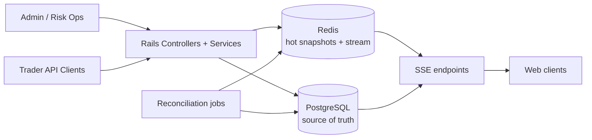

# Iteration 005 Plan V1: Hot/Cold Storage for Volatility Bursts

## Objective
Handle high-frequency pricing and market activity updates with:
- cold source of truth in PostgreSQL
- hot transient state in Redis for low-latency reads, event fanout, and SSE delivery

## Component Diagram

## Consistency Model
- Canonical write: PostgreSQL commit is authoritative.
- Hot projection: after a successful cold write, Rails projects market snapshot into Redis and appends a stream event.
- Read policy for SSE:
  - first read hot snapshot from Redis (fast path)
  - if cache miss, rebuild from PostgreSQL and warm Redis (fallback path)
- Consistency level:
  - strong consistency for cold reads/writes
  - eventual consistency for hot snapshots and stream fanout
- Ordering:
  - market version is `updated_at` in milliseconds
  - consumers ignore events with older `version`

## Write Paths
1. Admin market create/update/settle
- write in PostgreSQL
- project full market snapshot to Redis key: `adivento:hot:v1:market:{id}:snapshot`
- append event to Redis stream: `adivento:hot:v1:market:{id}:events`

2. Admin market leg create
- write leg in PostgreSQL
- re-project full snapshot to Redis

3. Bet placement
- write bet/ledger/audit in PostgreSQL transaction
- re-project snapshot to Redis with updated `total_open_interest_minor`

## Failure Modes and Behavior
1. Redis unavailable at write time
- Cold write still succeeds.
- Hot projection is skipped safely (null adapter fallback).
- Next reconcile job repairs missing hot state.

2. Redis snapshot missing at read time
- SSE endpoint rebuilds from PostgreSQL and warms Redis.
- Client still receives valid snapshot event.

3. Redis stream event dropped or evicted
- Hot snapshot remains latest point-in-time view.
- Reconciliation repopulates snapshot and emits fresh event.

4. Out-of-order fanout
- Consumers compare `version` and keep monotonic state.

5. Stale hot snapshot after deploy/restart
- Reconciliation scans markets and rewrites mismatched versions.

## Reconciliation Jobs
- Job: `HotStorage::ReconcileMarketHotStateJob`
- Trigger: periodic scheduler (every 15-60s for open markets) or manual run.
- Logic:
  - read hot snapshot version
  - compute cold version from PostgreSQL
  - if mismatch or missing, re-project snapshot and append event

## Minimal Implementation Slice (This Iteration)
- Hot store abstraction:
  - `app/services/hot_storage/store.rb`
- Snapshot projection/read:
  - `app/services/hot_storage/market_snapshot_projector.rb`
  - `app/services/hot_storage/market_snapshot_reader.rb`
- Reconciliation:
  - `app/jobs/hot_storage/reconcile_market_hot_state_job.rb`
- Write-path integration:
  - `app/controllers/admin/markets_controller.rb`
  - `app/controllers/admin/market_legs_controller.rb`
  - `app/controllers/bets_controller.rb`
- SSE fast-path integration:
  - `app/controllers/sse/markets_controller.rb`

## Test Coverage in Slice
- Service tests:
  - projector writes hot snapshot and stream events
  - reader uses hot snapshot or cold fallback
- Job tests:
  - reconciliation repairs stale hot snapshot
- Integration tests:
  - SSE market endpoint serves hot snapshot data when available

## Rollout Notes
- Set `REDIS_URL` in environment to enable real Redis hot path.
- Without Redis, null adapter keeps app functional while cold path remains authoritative.
- Add scheduler entry for `HotStorage::ReconcileMarketHotStateJob` after deployment.
